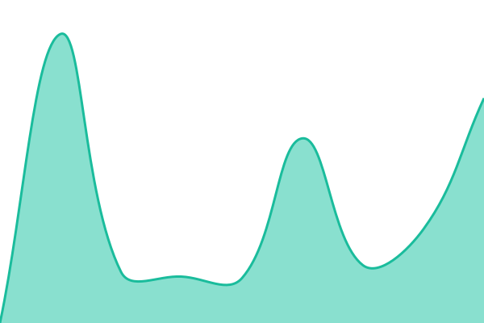

# [📈 Live Status](https://agx.github.io/phosh-uptime): <!--live status--> **🟩 All systems operational**

This repository contains the open-source uptime monitor and status page for [phosh](https://phosh.mobi), powered by [Upptime](https://github.com/upptime/upptime).

With [Upptime](https://upptime.js.org), you can get your own unlimited and free uptime monitor and status page, powered entirely by a GitHub repository. We use [Issues](https://github.com/agx/phosh-uptime/issues) as incident reports, [Actions](https://github.com/agx/phosh-uptime/actions) as uptime monitors, and [Pages](https://agx.github.io/phosh-uptime) for the status page.

<!--start: status pages-->
<!-- This summary is generated by Upptime (https://github.com/upptime/upptime) -->
<!-- Do not edit this manually, your changes will be overwritten -->
<!-- prettier-ignore -->
| URL | Status | History | Response Time | Uptime |
| --- | ------ | ------- | ------------- | ------ |
|  [phosh.mobi](https://phosh.mobi) | 🟩 Up | [phosh-mobi.yml](https://github.com/agx/phosh-uptime/commits/HEAD/history/phosh-mobi.yml) | 

 776ms
     
 | 

<a href="https://agx.github.io/phosh-uptime/history/phosh-mobi">100.00%</a>
    

|  [deb.phosh.mobi](https://deb.phosh.mobi) | 🟩 Up | [deb-phosh-mobi.yml](https://github.com/agx/phosh-uptime/commits/HEAD/history/deb-phosh-mobi.yml) | 

 872ms
     
 | 

<a href="https://agx.github.io/phosh-uptime/history/deb-phosh-mobi">100.00%</a>
    

|  [sources.phosh.mobi](https://sources.phosh.mobi) | 🟩 Up | [sources-phosh-mobi.yml](https://github.com/agx/phosh-uptime/commits/HEAD/history/sources-phosh-mobi.yml) | 

 792ms
     
 | 

<a href="https://agx.github.io/phosh-uptime/history/sources-phosh-mobi">100.00%</a>
    

|  [images.phosh.mobi](https://images.phosh.mobi) | 🟩 Up | [images-phosh-mobi.yml](https://github.com/agx/phosh-uptime/commits/HEAD/history/images-phosh-mobi.yml) | 

 724ms
     
 | 

<a href="https://agx.github.io/phosh-uptime/history/images-phosh-mobi">100.00%</a>
    

|  [gitlab.gnome.org](https://gitlab.gnome.org/World/Phosh) | 🟩 Up | [gitlab-gnome-org.yml](https://github.com/agx/phosh-uptime/commits/HEAD/history/gitlab-gnome-org.yml) | 

 376ms
     
 | 

<a href="https://agx.github.io/phosh-uptime/history/gitlab-gnome-org">100.00%</a>
    

|  [Nightly build job](https://salsa.debian.org/BengalOS-team/bengalos-debs) | 🟩 Up | [nightly-build-job.yml](https://github.com/agx/phosh-uptime/commits/HEAD/history/nightly-build-job.yml) | 

 1515ms
     
 | 

<a href="https://agx.github.io/phosh-uptime/history/nightly-build-job">100.00%</a>
    

|  [Phosh.mobi e.V.](https://ev.phosh.mobi/) | 🟩 Up | [phosh-mobi-e-v.yml](https://github.com/agx/phosh-uptime/commits/HEAD/history/phosh-mobi-e-v.yml) | 

 1031ms
     
 | 

<a href="https://agx.github.io/phosh-uptime/history/phosh-mobi-e-v">100.00%</a>
    

|  [Fedi](https://social.phosh.mobi/@phosh) | 🟩 Up | [fedi.yml](https://github.com/agx/phosh-uptime/commits/HEAD/history/fedi.yml) | 

 1384ms
     
 | 

<a href="https://agx.github.io/phosh-uptime/history/fedi">100.00%</a>
    

<!--end: status pages-->

[**Visit our status website →**](https://agx.github.io/phosh-uptime)

## 📄 License

- Powered by: [Upptime](https://github.com/upptime/upptime)
- Code: [MIT](./LICENSE) © [Anand Chowdhary](https://anandchowdhary.com), supported by [Pabio](https://pabio.com)
- Data in the `./history` directory: [Open Database License](https://opendatacommons.org/licenses/odbl/1-0/)
